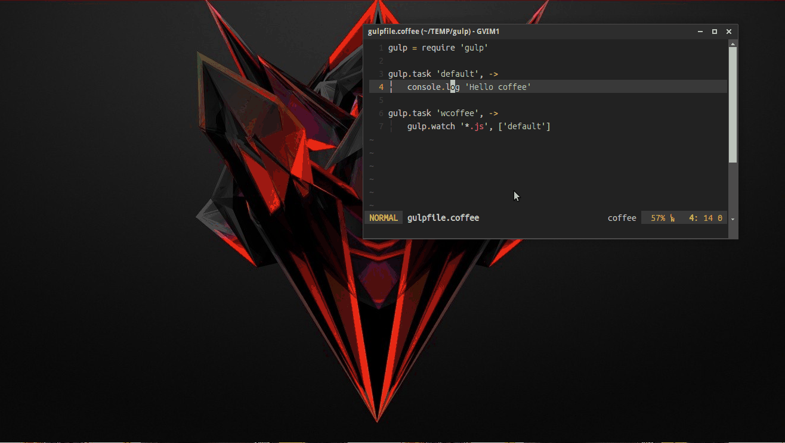

Gulp-vim + ctrlp-gulp + unite-gulp [](https://badge.fury.io/gh/kabbamine%2Fgulp-vim)
==================================

> Starting from version `0.8.0` the plugin uses [semantic versionning 2.0.0](http://semver.org/).

Description
-----------

This plugin is a simple [gulp](http://gulpjs.com) wrapper for vim.
*(Works on GNU/Linux and Windows)*



### Features

* Run gulp inside Vim.
* Run gulp in the backgound using an external terminal without losing focus.
* Run gulp using a custom shell or vim command.
* List your gulp tasks.
* Support different gulpfiles (`.js`, `.babel.js`, `.coffee`).
* [CtrlP](https://github.com/ctrlpvim/ctrlp.vim) integration.
* [Unite](https://github.com/shougo/unite.vim) source.

Installation
-----------

Use your preferred method to install the plugin. I recommend you to use a plugin manager.

e.g with [Vim-plug](https://github.com/junegunn/vim-plug)

```
Plug 'KabbAmine/gulp-vim'
```

This is not mandatory, but the plugin can use [Tpope's Dispatch plugin](https://github.com/tpope/vim-dispatch) if its installed (**P.S:** This integration will be removed in the future versions, the `g:gv_custom_cmd` is a better choice).

Usage
---------

### Main commands

Gulp-vim provides 2 main commands: `Gulp` and `GulpExt`.

Both commands accept 0 or many arguments (Task name(s)), that can be [completed](#completion) using `<Tab>`. If no task name is provided, *'default'* will be used.

```
:Gulp    [task(s)...]
:GulpExt [task(s)...]
```

* The command `Gulp` executes gulp inside Vim.
* The command `GulpExt` by default executes gulp in an external terminal:
  - The default one via `exo-open` in GNU/Linux or a simple `cmd` in Windows.
  - Use a defined user command.
  - Use [Dispatch](#dispatch) if its installed (WILL BE REMOVED).

  **===> Unix only:** (G)Vim doesn't lose focus if [wmctrl](https://sites.google.com/site/tstyblo//wmctrl/) is installed.

---------------------------

**Don't use gulp watching tasks with the command `Gulp` (`<Ctrl-C>` to stop it), use `GulpExt` instead**.

---------------------------

### CtrlP Integration

You can execute gulp tasks with CtrlP (Works only if CtrlP is installed of course).
Check the [configuration](#ctrlp).

```
:CtrlpGulp
```

### Unite source

A `gulp` Unite source is provided, see [configuration](#unite).

```
:Unite -buffer-name=gulp gulp
```

### Misc

```
:GulpTasks
```

Shows a list of your gulp task names (Extracted from the current `gulpfile`).

```
:GulpFile [gulpfile]
```

Define the `gulpfile` to use, e.g. `gulpfile.js`, `gulpfile.coffee`, `gulpfile.babel.js` (Set it to `gulpfile.js` when used without argument).

In fact, this command just assign a value to `g:gv_default_gulpfile`.

---------------------------

Configuration
---------

### Rvm hack

If you're using [rvm](https://rvm.io/) in GNU/Linux, when using `GulpExt` or a custom command, rvm shell functions will not be exported so your gems and some gulp plugins will not work (`gulp-compass` as an example).

To get rid of that add to your vimrc:

```
let g:gv_rvm_hack = 1
```

If its not working, consider using [Tpope's vim-rvm plugin](https://github.com/tpope/vim-rvm).

### Go back to the shell prompt

By default with `GulpExt`, when the gulp task is completed, the terminal is closed.
If you want to go back to the shell prompt after executing the task, add to your vimrc:

```
let g:gv_return_2_prompt = 1
```

**P.S:** If you are using a custom command it will not work.

### Specify the gulpfile

You can specify the gulpfile to use with `g:gv_default_gulpfile` variable (By default, it's `gulpfile.js`).

e.g.
```
let g:gv_default_gulpfile = 'gulpfile.coffee'
" Or
let g:gv_default_gulpfile = 'gulpfile.babel.js'
```

**P.S:** The paths are not considered.

### Use dispatch <a id="dispatch"></a>

**THIS INTEGRATION WILL BE REMOVED IN THE FUTURE VERSIONS**

By default if the plugin Dispatch is installed, the command `GulpExt` will use `Start!` to execute Gulp, this means:

* In Linux: If you're in tmux, a new window will be created otherwise the default terminal will be open.
* In Windows: A minimized cmd.exe window is spawned.

You can disable this integration by setting `g:gv_use_dispatch` to `0`

```
let g:gv_use_dispatch = 0
```

### CtrlP default command <a id="ctrlp"></a>

You can specify which gulp-vim command to use with `CtrlpGulp` (`Gulp` by default)):

```
let g:gv_ctrlp_cmd = 'GulpExt'
```

### Unite default command <a id="unite"></a>

You can specify which gulp-vim command to use with the `gulp` Unite source action (`Gulp` by default)):

```
let g:gv_unite_cmd = 'GulpExt'
```

### Custom command

You can specify a custom command to use with `GulpExt` via `g:gv_custom_cmd`.

This variable can be a list or a string where `%s` will be replaced by the adequate shell command.
It can be a vim command (If you want to use external vim plugin) or a shell command.

e.g using `Dispatch`:
```
let g:gv_custom_cmd = 'Start! %s'
```

Be aware that the gulp shell command can contain double quotes, so if you need to escape them use a list instead of a string and define its 2nd element to 1.

e.g using [Vimux](https://github.com/benmills/vimux) plugin:
```
let g:gv_custom_cmd = ['VimuxRunCommand "clear && %s"', 1]
```

More examples can be found on the [wiki](https://github.com/KabbAmine/gulp-vim/wiki/Use-a-custom-command).

Extra
------

### Completion <a id="completion"></a>

Gulp-vim searches for a *gulpfile* (`g:gv_default_gulpfile`) in the current vim directory (`:pwd`) then extract from it task names to provide command completion (This method is quicker than using `gulp --tasks-simple`).

This may change a little in the future versions, see #2.

TODO
-----

- [ ] Merge `Gulp` and `GulpExt` into one command `Gulp[!]`

My configuration
----------------

```
let g:gv_rvm_hack = 1
let g:gv_use_dispatch = 0
" Use vimux on Linux & dispatch on windows
let g:gv_custom_cmd = has('unix') ?
			\ ['VimuxRunCommand "clear && %s"', 1] :
			\ 'Start! %s'
let g:gv_ctrlp_cmd = 'GulpExt'
nnoremap ,g :CtrlPGulp<CR>
```

NOTES
-----

Thanks to gulp author(s).

Thanks to Bram Moolenaar for creating the best piece of software in the world :heart:

Thanks to you if you're using gulp-vim.
